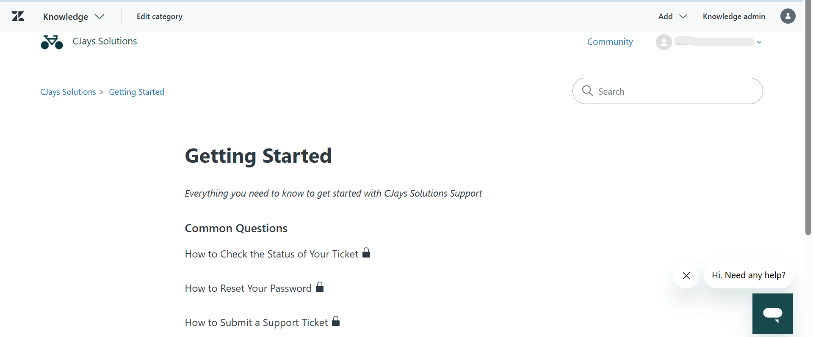
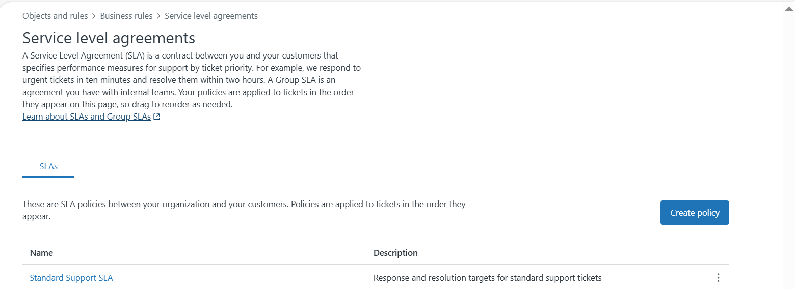
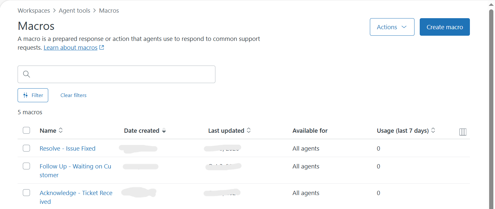
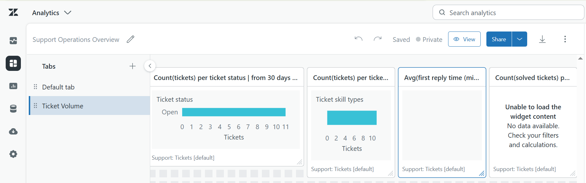
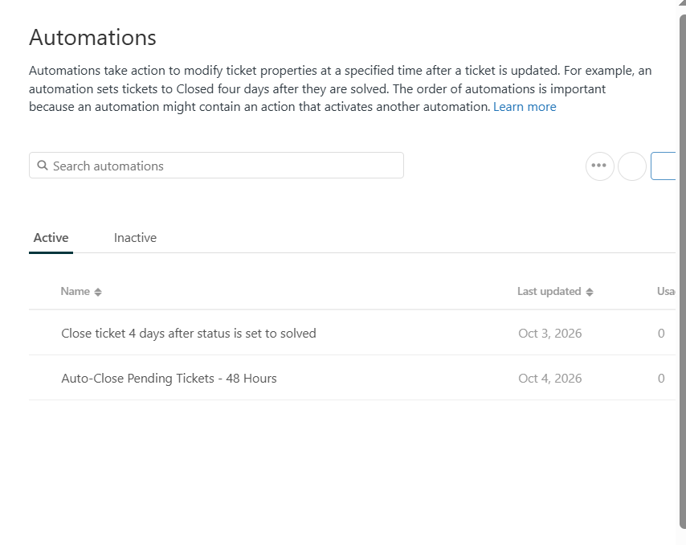
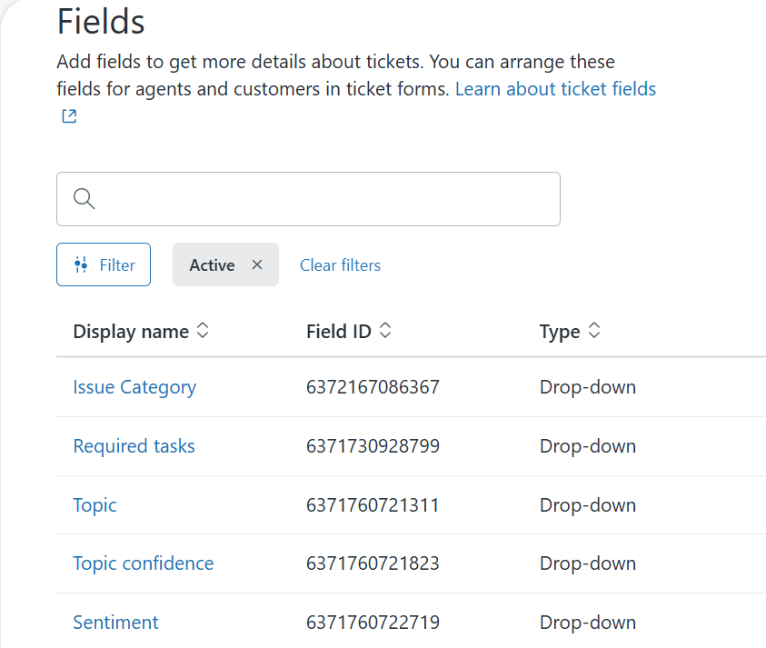
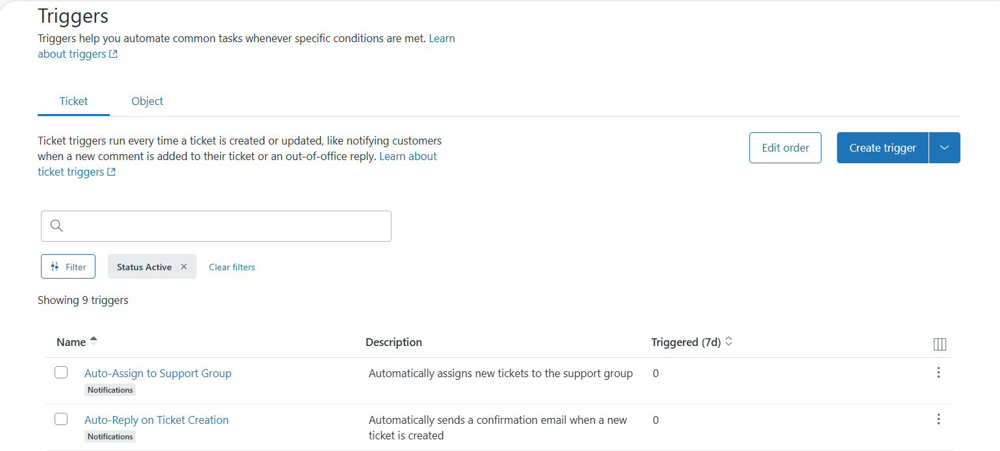
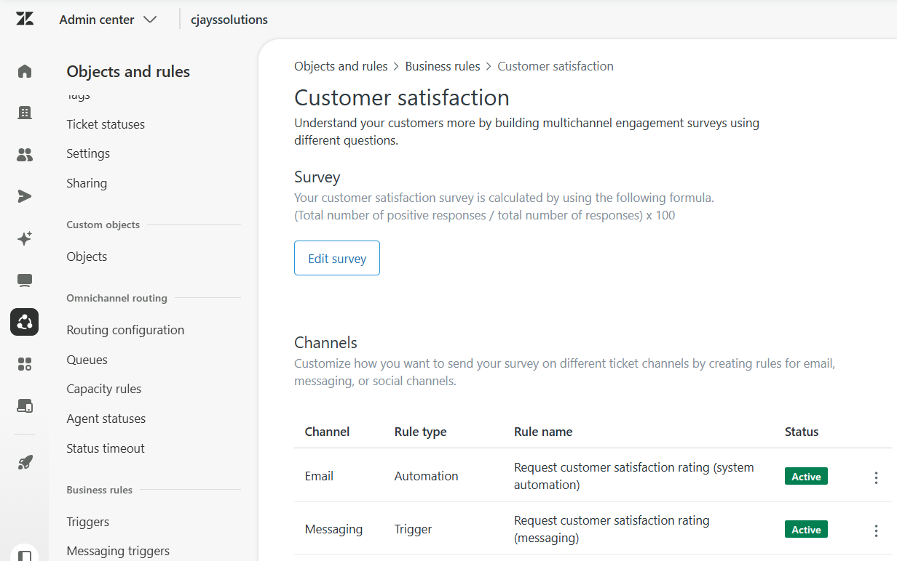
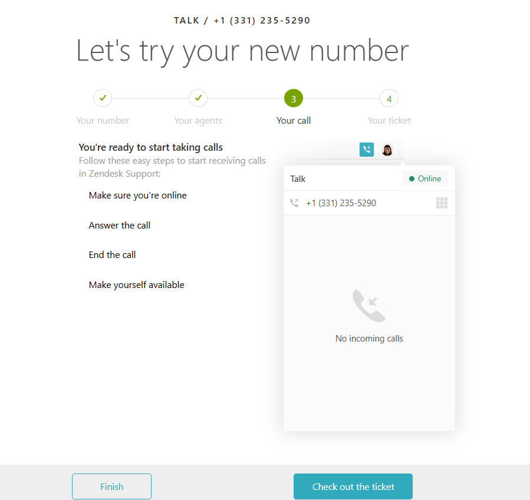
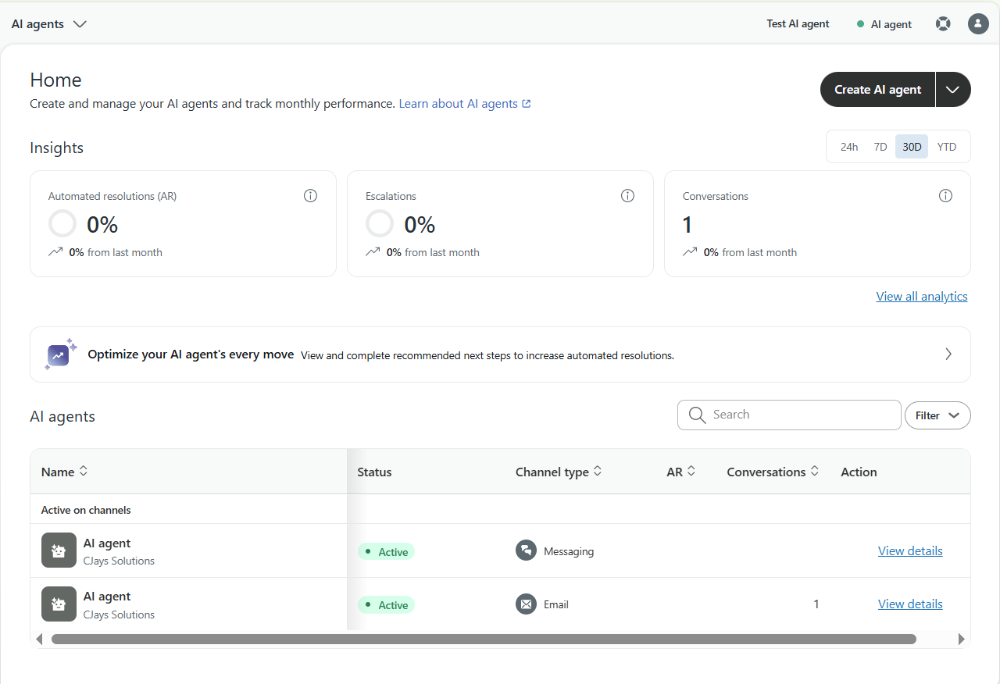

# Zendesk Support Administration Portfolio

**Clement Okeniyi** · Support Operations Administrator  
`cjayssolutions.zendesk.com`

---

## Overview

This repository documents the audit and optimization of a Zendesk Support instance for CJays Solutions, an e-commerce brand. The scope covers the full support operations stack — routing architecture, SLA governance, automation, omnichannel configuration, AI deflection, analytics, and agent enablement.

Every configuration decision is documented against the operational problem it solves.

📋 [Audit Report](audit-report.md) · 🔌 [Integration Architecture](integration-architecture.md) · 📁 [SOPs](SOPs/)

---

## 🛠 Tech Stack

---

## Configuration Summary

| Component | Details |
|-----------|---------|
| 👁 Views | 3 custom views (Open, Pending, Solved 30d) |
| ⚡ Triggers | 4 (Auto-reply, Auto-assign, Routing ×3) |
| 🤖 Automations | Auto-close pending — 48hr inactivity |
| 📝 Macros | 3 (Acknowledge, Follow-Up, Resolve) |
| ⏱ SLA Policy | 4-tier by priority |
| 👥 Groups | 3 skill-based (Billing, Technical, General) |
| 🏷 Custom Fields | Issue Category — 5 values |
| 📚 Help Center | 3 self-service articles |
| 📞 Voice | Zendesk Talk — +1 (331) 235-5290 |
| ⭐ CSAT | Post-resolution surveys active |
| 🧠 AI Agents | Active on Messaging + Email |
| 📊 Reporting | 4-report custom Explore dashboard |

---

## Audit Findings & Resolutions

### 🔀 Routing Architecture
Tickets were landing in a single unmanaged queue with no assignment logic. Implemented skill-based routing using three agent groups — Billing Support, Technical Support, General Support — with trigger logic keyed to a custom Issue Category field. All assignment is now automated at ticket creation.

---

### ⏱ SLA Governance
No SLA policy existed. Defined a four-tier policy by priority — Urgent (1hr FRT), High (4hr), Normal (8hr), Low (24hr) — with breach visibility on every ticket. Agents have clear response targets and managers have breach data in Explore.

---

### 📝 Response Consistency
Agent replies were unstructured and inconsistent across the team. Deployed three macros covering the full ticket lifecycle — acknowledgement, follow-up, and resolution — standardizing tone and reducing average handle time.

---

### 📊 Reporting & Visibility
No performance reporting existed. Built a custom Explore dashboard with four reports: ticket volume by status, volume by Issue Category, average first reply time, and resolved tickets per agent. Leadership now has real-time operational visibility.

---

### 📚 Self-Service Deflection
All contacts required agent handling regardless of complexity. Published three Help Center articles covering the highest-volume query types, enabling customers to self-serve before submitting a ticket.

---

### 🧹 Queue Hygiene
Agents were manually managing stale pending tickets. Configured an automation to send a follow-up prompt and close tickets after 48 hours of customer inactivity. Queue stays current without agent intervention.

---

### 🏷 Ticket Taxonomy
No structured data was being captured at ticket creation. Added a custom Issue Category field — Billing, Technical, Access, Inquiry, Feature Request — used for routing, Explore reporting, and capacity planning.

---

### ⚡ Trigger Architecture
Built a trigger set handling auto-acknowledgement on ticket creation and group assignment by category — ensuring every ticket gets a response and lands with the right team without manual intervention.

---

### ⭐ Customer Satisfaction Measurement
No CSAT mechanism existed. Enabled post-resolution satisfaction surveys to create a continuous feedback loop between customer experience and team performance.

---

### 📞 Voice Channel
Support was email-only with no call handling capability. Provisioned Zendesk Talk with a dedicated support number. All calls are automatically logged as tickets, keeping the full customer history in one system.

---

### 🧠 AI Deflection
All inbound contacts were routed directly to human agents. Activated AI agents on both Messaging and Email channels to handle first contact and resolve common queries autonomously. Escalation to human agents is triggered when resolution confidence is low.

---

## 📁 Documentation

| Document | Description |
|----------|-------------|
| [Audit Report](audit-report.md) | Full gap analysis and remediation summary |
| [Integration Architecture](integration-architecture.md) | API, webhooks, and Shopify integration design |
| [SOP: Ticket Handling](SOPs/01-ticket-handling.md) | Step-by-step ticket process for agents |
| [SOP: Escalation Process](SOPs/02-escalation-process.md) | When and how to escalate |
| [SOP: New Agent Onboarding](SOPs/03-new-agent-onboarding.md) | Getting new agents productive fast |
| [SOP: Change Management](SOPs/04-change-management.md) | Safe deployment of configuration changes |

---

*Effective support operations require deliberate architecture — not just tool access. Every element in this instance is configured to a specific purpose: route accurately, respond consistently, measure what matters, and reduce friction for both customers and agents.*

